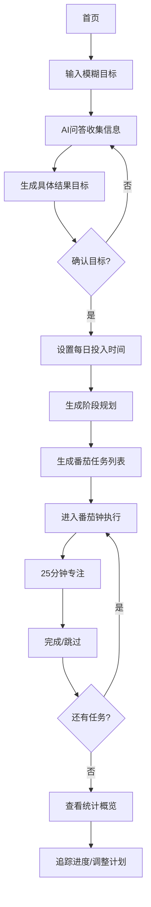

## 1. 产品概述

**番茄AI - 目标拆解与时间管理助手**

将模糊目标通过AI问答转化为具体可执行的番茄钟任务，帮助拖延症和注意力不集中人群提升目标实现效率。

- **核心目的**：解决目标模糊、缺乏执行计划、工作注意力易分散的问题
- **目标用户**：拖延症、多动症人群，以及希望提升时间管理效率的学习者和工作者
- **产品价值**：作为个人实现人生目标的导师和教练，帮助用户达成人生心愿

---

## 2. 核心功能

### 2.1 用户角色
| 角色 | 注册方式 | 核心权限 |
|------|---------|---------|
| 普通用户 | 无需注册，本地存储 | 创建目标、生成计划、使用番茄钟、查看统计 |

### 2.2 功能模块
1. **目标创建页**：输入模糊目标，AI对话拆解为具体结果目标
2. **计划生成页**：根据目标和每日可投入时间，生成阶段规划和番茄钟任务
3. **番茄钟执行页**：25分钟倒计时、任务提醒、专注状态管理
4. **统计概览页**：完成进度、专注时长、效率分析

### 2.3 页面详情
| 页面名称 | 模块名称 | 功能描述 |
|---------|---------|---------|
| 目标创建页 | 目标输入区 | 用户输入模糊目标，如"我想学英语" |
| 目标创建页 | AI对话区 | AI追问关键信息，如目标时间、当前水平、学习方式偏好等 |
| 目标创建页 | 结果目标展示 | 展示AI生成的具体结果目标和成功标准 |
| 计划生成页 | 参数设置 | 设置每日可投入时间、偏好学习时段 |
| 计划生成页 | 阶段规划展示 | 展示整体阶段目标和时间线 |
| 计划生成页 | 番茄任务列表 | 展示每个番茄周期的具体任务、内容、注意事项 |
| 番茄钟执行页 | 倒计时器 | 25分钟番茄钟倒计时，支持开始/暂停/跳过 |
| 番茄钟执行页 | 任务详情 | 当前番茄周期的任务内容和注意事项 |
| 番茄钟执行页 | 专注状态 | 展示专注状态、完成进度、连续专注次数 |
| 统计概览页 | 进度统计 | 目标完成进度、已完成番茄数、总专注时长 |
| 统计概览页 | 效率分析 | 专注效率、最佳专注时段、拖延趋势分析 |
| 统计概览页 | 目标管理 | 查看、编辑、删除已有目标 |

---

## 3. 核心流程

**用户流程：**
1. 用户进入首页，看到创建目标入口
2. 输入模糊目标（如"我想学英语"）
3. AI通过问答收集关键信息（目标时间、当前水平、学习方式等）
4. AI生成具体结果目标和成功标准
5. 用户确认后，设置每日可投入时间
6. AI生成阶段规划和番茄钟任务列表
7. 用户进入番茄钟执行界面开始专注
8. 每个番茄周期完成后记录进度
9. 用户可查看统计概览追踪目标完成情况

---

## 4. 用户界面设计

### 4.1 设计风格
- **主色调**：温暖活力的橙色系（象征番茄、能量、专注），搭配沉稳的深蓝色作为辅助色
- **按钮风格**：圆角矩形，主按钮橙色渐变，悬停时有轻微放大和阴影效果
- **字体**：使用现代简洁的无衬线字体，标题字重较大，正文清晰易读
- **布局风格**：卡片式布局，信息层次分明，留白适度
- **图标风格**：简约线性图标，番茄元素贯穿始终

### 4.2 页面设计概述
| 页面名称 | 模块名称 | UI元素 |
|---------|---------|-------|
| 首页 | Hero区域 | 大标题、产品介绍、创建目标按钮、装饰性番茄图形 |
| 首页 | 目标列表 | 卡片展示已有目标，显示进度条 |
| 目标创建页 | 目标输入 | 大输入框、引导提示文字 |
| 目标创建页 | AI对话 | 聊天气泡样式，AI头像、用户输入框 |
| 目标创建页 | 结果展示 | 卡片展示具体目标，打勾确认 |
| 计划生成页 | 参数设置 | 时间选择器、滑块、开关选项 |
| 计划生成页 | 阶段规划 | 时间轴样式、里程碑节点 |
| 计划生成页 | 任务列表 | 可折叠的任务卡片，显示任务内容和时长 |
| 番茄钟执行页 | 倒计时器 | 圆形进度条、大数字显示、开始/暂停按钮 |
| 番茄钟执行页 | 任务详情 | 卡片展示当前任务、注意事项 |
| 番茄钟执行页 | 专注状态 | 火焰图标表示专注强度、连续专注计数器 |
| 统计概览页 | 进度统计 | 环形图、柱状图、数字统计卡片 |
| 统计概览页 | 效率分析 | 折线图、趋势分析文字 |
| 统计概览页 | 目标管理 | 目标列表、操作按钮（编辑/删除） |

### 4.3 响应式设计
- **桌面端**：多栏布局，侧边栏导航，充分利用屏幕空间
- **平板端**：响应式布局，导航栏自适应
- **移动端**：单栏布局，底部导航，触控优化的大按钮

---

## 5. 数据存储

### 5.1 本地存储数据
- 用户目标信息（名称、描述、状态）
- AI生成的结果目标和成功标准
- 阶段规划数据
- 番茄钟任务列表
- 专注记录（日期、时长、完成状态）
- 用户偏好设置

---

## 6. AI能力集成

### 6.1 AI功能
1. **目标拆解**：将模糊目标转化为具体结果目标
2. **计划生成**：根据目标和时间参数生成阶段规划
3. **任务细化**：为每个番茄周期生成具体任务内容
4. **智能提醒**：根据用户习惯提供个性化建议

### 6.2 问答流程
- 询问目标的时间期限
- 了解用户当前水平或基础
- 询问学习/工作方式偏好
- 确认目标的成功标准
