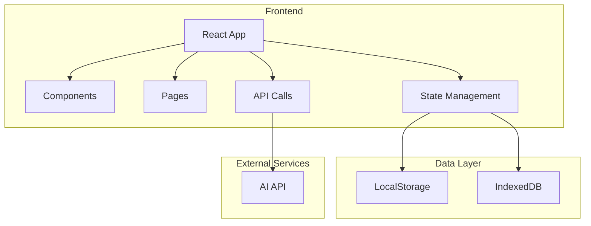

## 1. 架构设计



## 2. 技术选型

- **前端框架**：React 18 + TypeScript
- **构建工具**：Vite 6
- **样式框架**：TailwindCSS 3
- **路由管理**：React Router v6
- **状态管理**：React Context + useState/useReducer
- **图标库**：Lucide React
- **图表库**：Recharts
- **数据存储**：LocalStorage（简单数据）+ IndexedDB（大量数据）
- **AI集成**：模拟AI问答（本地预设逻辑）

## 3. 路由定义

| 路由 | 页面组件 | 功能描述 |
|------|---------|---------|
| / | HomePage | 首页，展示目标列表和创建入口 |
| /create | CreateGoalPage | 目标创建页，AI问答拆解目标 |
| /plan/:goalId | PlanPage | 计划生成页，展示阶段规划和任务列表 |
| /timer/:goalId | TimerPage | 番茄钟执行页，25分钟倒计时 |
| /stats | StatsPage | 统计概览页，进度和效率分析 |

## 4. 组件结构

```
src/
├── components/
│   ├── common/           # 通用组件
│   │   ├── Button.tsx
│   │   ├── Card.tsx
│   │   ├── Input.tsx
│   │   └── ProgressBar.tsx
│   ├── goal/             # 目标相关组件
│   │   ├── GoalCard.tsx
│   │   ├── GoalList.tsx
│   │   └── GoalForm.tsx
│   ├── ai/               # AI对话组件
│   │   ├── ChatBubble.tsx
│   │   ├── ChatInput.tsx
│   │   └── ChatContainer.tsx
│   ├── timer/            # 番茄钟组件
│   │   ├── TimerDisplay.tsx
│   │   ├── TimerControls.tsx
│   │   └── TaskDetail.tsx
│   ├── plan/             # 计划相关组件
│   │   ├── PhaseTimeline.tsx
│   │   ├── TaskCard.tsx
│   │   └── TaskList.tsx
│   └── stats/            # 统计组件
│       ├── StatCard.tsx
│       ├── ProgressChart.tsx
│       └── TrendChart.tsx
├── pages/
│   ├── HomePage.tsx
│   ├── CreateGoalPage.tsx
│   ├── PlanPage.tsx
│   ├── TimerPage.tsx
│   └── StatsPage.tsx
├── context/
│   └── AppContext.tsx    # 全局状态管理
├── hooks/
│   ├── useTimer.ts       # 番茄钟计时器hook
│   ├── useLocalStorage.ts # 本地存储hook
│   └── useAI.ts          # AI问答逻辑hook
├── types/
│   └── index.ts          # TypeScript类型定义
├── utils/
│   ├── aiMock.ts         # 模拟AI逻辑
│   ├── storage.ts        # 存储工具函数
│   └── helpers.ts        # 通用工具函数
└── App.tsx
```

## 5. 数据模型

### 5.1 TypeScript类型定义

```typescript
interface Goal {
  id: string;
  name: string;
  description: string;
  status: 'draft' | 'planning' | 'in-progress' | 'completed';
  createdAt: Date;
  targetDate: Date;
  resultGoal: string;
  successCriteria: string[];
}

interface Phase {
  id: string;
  goalId: string;
  name: string;
  startDate: Date;
  endDate: Date;
  progress: number;
  tasks: string[];
}

interface PomodoroTask {
  id: string;
  goalId: string;
  phaseId: string;
  title: string;
  content: string;
  notes: string[];
  duration: number; // 分钟
  status: 'pending' | 'in-progress' | 'completed' | 'skipped';
  completedAt?: Date;
}

interface FocusRecord {
  id: string;
  goalId: string;
  taskId: string;
  date: Date;
  duration: number; // 秒
  completed: boolean;
}

interface UserPreferences {
  dailyFocusHours: number;
  preferredStartTime: string;
  preferredEndTime: string;
  soundEnabled: boolean;
  notificationEnabled: boolean;
}
```

### 5.2 数据存储方案

| 数据类型 | 存储方式 | 存储键 |
|---------|---------|--------|
| 目标列表 | LocalStorage | tomato_goals |
| 阶段规划 | LocalStorage | tomato_phases |
| 番茄任务 | LocalStorage | tomato_tasks |
| 专注记录 | IndexedDB | focus_records |
| 用户偏好 | LocalStorage | tomato_preferences |

## 6. 核心API（模拟）

### 6.1 AI问答模拟接口

```typescript
// 模拟AI追问逻辑
function getAIQuestion(goal: string, answers: Answer[]): string;

// 模拟AI生成结果目标
function generateResultGoal(goal: string, answers: Answer[]): {
  resultGoal: string;
  successCriteria: string[];
};

// 模拟AI生成阶段规划
function generatePlan(goal: Goal, dailyHours: number): Phase[];

// 模拟AI生成番茄任务
function generatePomodoroTasks(phase: Phase): PomodoroTask[];
```

### 6.2 存储接口

```typescript
// 目标操作
function saveGoal(goal: Goal): void;
function getGoal(id: string): Goal | null;
function getAllGoals(): Goal[];
function updateGoal(id: string, updates: Partial<Goal>): void;
function deleteGoal(id: string): void;

// 任务操作
function saveTasks(tasks: PomodoroTask[]): void;
function getTasksByGoal(goalId: string): PomodoroTask[];
function updateTaskStatus(taskId: string, status: PomodoroTask['status']): void;

// 专注记录
function saveFocusRecord(record: FocusRecord): void;
function getFocusRecordsByGoal(goalId: string): FocusRecord[];
function getTotalFocusTime(): number;
```

## 7. 核心业务逻辑

### 7.1 番茄钟逻辑
- 默认25分钟工作 + 5分钟休息
- 每4个番茄周期后休息15分钟
- 支持开始/暂停/跳过操作
- 完成后自动记录专注时间

### 7.2 AI问答流程
1. 用户输入模糊目标
2. AI依次询问：时间期限、当前水平、学习方式、成功标准
3. 根据回答生成具体结果目标
4. 用户确认后进入计划生成

### 7.3 计划生成逻辑
1. 根据目标和时间参数计算总番茄数
2. 按阶段拆分（入门、进阶、精通）
3. 为每个阶段生成具体任务
4. 为每个任务分配番茄时间

## 8. 开发环境

- Node.js 20+
- npm 10+
- Vite 6
- TailwindCSS 3

## 9. 部署方案

- 静态资源部署（Vite build）
- 可部署至 Netlify、Vercel、GitHub Pages
- 无需后端服务器，纯前端应用
